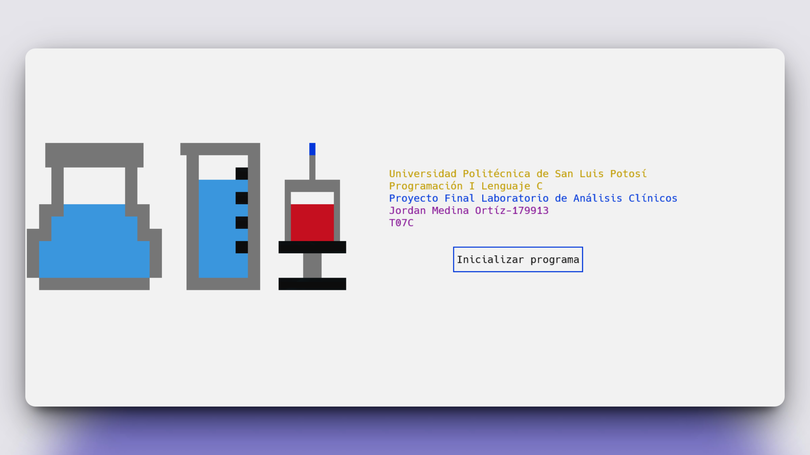

<h1 align="center">Sistema de Laboratorio de Análisis Clínicos en C 🧪💻</h1>

<p align="left">
  <a href="README.md" target="_blank">
    View README in English
  </a>
</p>

<p>Este repositorio contiene el código fuente de mi proyecto final del curso de Programación 1, donde desarrollé un sistema de consola para la gestión de un laboratorio de análisis clínicos utilizando el lenguaje de programación C.
El proyecto simula operaciones reales como el registro de pacientes, el control de pruebas de laboratorio y la generación de reportes, todo mediante manejo estructurado de datos y archivos.</p>

<h1 align="center">Tecnología Utilizada</h1>
<div align="center">
  
</div>
<hr>

<h1 align="center">Objetivo</h1>
<ul>
  <li>Aplicar conocimientos fundamentales de programación en una simulación del mundo real.</li>
  <li>Implementar un <b>sistema completo de gestión de laboratorio clínico.</b></li>
  <li>Practicar <b>manejo de archivos, validación de datos, arreglos</b> y <b>estructuras</b> en C.</li>
  <li>Entregar un programa robusto y completamente funcional para gestionar pacientes y análisis clínicos.</li>
</ul>
<hr>

<h1 align="center">Características Principales</h1>
<ul>
  <li><b>Manipulación avanzada de arreglos:</b> Usa arreglos 1D y 2D para gestionar los datos clínicos de manera eficiente.</li>
  <li><b>Estructuras para organización:</b> Modela entidades clave como pacientes y pruebas mediante structs, mejorando la legibilidad y mantenibilidad.</li>
  <li><b>Manejo de archivos:</b> Lee y escribe en archivos `.txt` (simulando exportaciones tipo Excel), permitiendo almacenamiento persistente.</li>
  <li><b>Validación estricta de entradas:</b> Cada campo pasa por una validación rigurosa para mantener la integridad y confiabilidad del sistema.</li>
  <li><b>Sistema de inicio de sesión:</b> Acceso seguro a las funcionalidades del sistema mediante credenciales de usuario.</li>
  <li><b>Gestión de pacientes y pruebas:</b> Agregar, listar, actualizar y eliminar datos de pacientes o pruebas clínicas.</li>
  <li><b>Generación de reportes:</b> Salida de informes basados en los datos existentes.</li>
</ul>
<hr>

<h1 align="center">Habilidades Adquiridas</h1>
<ul>
  <li>Dominio en el uso de <b>arreglos y estructuras</b> en C.</li>
  <li>Manejo y estructuración de <b>operaciones con archivos</b> para datos persistentes.</li>
  <li>Diseño de un sistema realista en terminal desde cero.</li>
  <li>Mejora de la <b>legibilidad y mantenibilidad del código.</b></li>
  <li>Comprensión de <b>buenas prácticas de validación de entradas.</b></li>
</ul>
<hr>

### Cómo Usar

1. Clona este repositorio en tu máquina local:

   ```sh
   git clone https://github.com/JordanMedinaOrtiz/laboratory-analysis-c.git
   cd laboratory-analysis-c
2. Compila el programa usando GCC u otro compilador compatible con C:
   ```sh
   gcc laboratorioAnalisisClinicos.c -o laboratorioAnalisisClinicos
   ```

3. Ejecuta el programa:
   ```sh
   ./laboratorioAnalisisClinicos
   ```
4. Credenciales de acceso:
   <ul>
     <li>Username: Jordan</li>
     <li>Password: 179913</li>
   </ul>
5. Interactúa con el sistema

<p>Este proyecto, desarrollado de forma individual, refleja mi progreso en programación en C mediante una aplicación funcional y compleja. Me permitió combinar lógica, manejo de datos y validaciones en un sistema cohesivo. Fue una excelente oportunidad para comprender cómo la programación puede aplicarse a problemas reales dentro del ámbito de la salud.</p>

